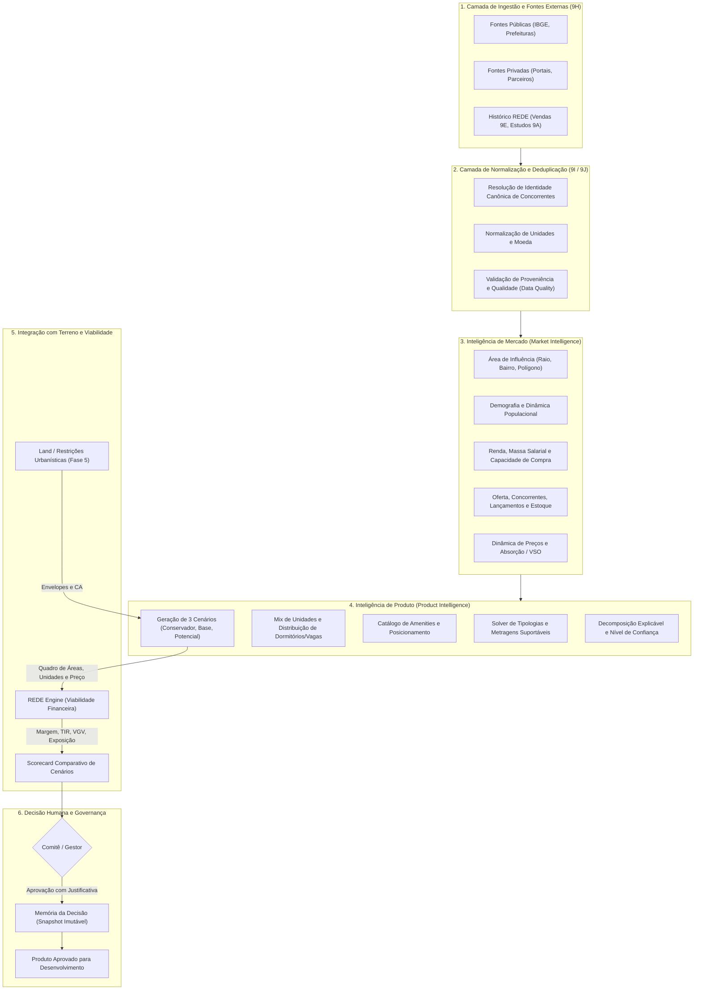

# REDE Intelligence — Plano Técnico da Fase 9J
# Inteligência de Mercado e Inteligência de Produto

> **Documento Oficial de Planejamento de Arquitetura (Fase 9J)**  
> **Base Ancestral Congelada:** `rede-phase-9i-complete-2026-08-23`  
> **Branch de Planejamento:** `planning/fase-9j-inteligencia-mercado-produto`  
> **Princípio Central:** "O dado nasce uma vez, mantém uma fonte oficial, atravessa os módulos e transforma fatos em decisões explicáveis."  
> **Pergunta Fundamental da Fase 9J:** *"Neste terreno e nesta localização, o que devemos construir, para quem, em qual configuração e em qual faixa de preço?"*  
> **Regra de Execução Desta Fase:** Esta é uma fase estritamente de PLANEJAMENTO. Nenhum código de produção foi implementado, nenhum schema foi alterado, nenhuma migration foi executada e o banco de dados não foi modificado.

---

## Sumário Executivo e Estrutura do Documento

- [A. Estado Atual Relevante (9A–9I)](#a-estado-atual-relevante-9a9i)
- [B. Reutilização de Modelos e Serviços](#b-reutilização-de-modelos-e-serviços)
- [C. Limites da Fase 9J](#c-limites-da-fase-9j)
- [D. Arquitetura Geral do Sistema](#d-arquitetura-geral-do-sistema)
- [E. Área de Mercado / Área de Influência (Market Area)](#e-área-de-mercado--área-de-influência-market-area)
- [F. Geografia e Índices Geográficos (Geography)](#f-geografia-e-índices-geográficos-geography)
- [G. Demografia (Demographics)](#g-demografia-demographics)
- [H. Renda e Massa Salarial (Income)](#h-renda-e-massa-salarial-income)
- [I. Capacidade de Compra e Financiamento (Affordability)](#i-capacidade-de-compra-e-financiamento-affordability)
- [J. Demanda Imobiliária (Demand)](#j-demanda-imobiliária-demand)
- [K. Oferta Imobiliária (Supply)](#k-oferta-imobiliária-supply)
- [L. Concorrentes e Concorrência (Competitors)](#l-concorrentes-e-concorrência-competitors)
- [M. Lançamentos e Histórico (Launches)](#m-lançamentos-e-histórico-launches)
- [N. Estoque Imobiliário e Dinâmica Temporal (Inventory)](#n-estoque-imobiliário-e-dinâmica-temporal-inventory)
- [O. Preços, Tabela, m² e Descontos (Prices)](#o-preços-tabela-m²-e-descontos-prices)
- [P. Vendas, Absorção e VSO (Sales / Absorption)](#p-vendas-absorção-e-vso-sales--absorption)
- [Q. Fontes Externas e Conectores Futuros (External Sources)](#q-fontes-externas-e-conectores-futuros-external-sources)
- [R. Proveniência e Confiança da Fonte (Provenance)](#r-proveniência-e-confiança-da-fonte-provenance)
- [S. Qualidade dos Dados de Mercado (Data Quality)](#s-qualidade-dos-dados-de-mercado-data-quality)
- [T. Histórico Temporal (Temporal History: What We Knew vs What Happened)](#t-histórico-temporal-temporal-history-what-we-knew-vs-what-happened)
- [U. Catálogo de Métricas de Mercado (Market Metrics)](#u-catálogo-de-métricas-de-mercado-market-metrics)
- [V. Comparabilidade e Similaridade de Mercado (Market Comparability)](#v-comparabilidade-e-similaridade-de-mercado-market-comparability)
- [W. Nível de Confiança de Mercado (Market Confidence)](#w-nível-de-confiança-de-mercado-market-confidence)
- [X. Inteligência de Produto (Product Intelligence)](#x-inteligência-de-produto-product-intelligence)
- [Y. Cenários de Produto (Product Scenario)](#y-cenários-de-produto-product-scenario)
- [Z. Mix de Tipologias e Distribuição (Mix)](#z-mix-de-tipologias-e-distribuição-mix)
- [AA. Tipologias Imobiliárias (Typologies)](#aa-tipologias-imobiliárias-typologies)
- [AB. Metragens e Eficiência Privativa (Unit Areas)](#ab-metragens-e-eficiência-privativa-unit-areas)
- [AC. Dormitórios, Suítes, Banheiros e Vagas (Bedrooms / Suites / Parking)](#ac-dormitórios-suítes-banheiros-e-vagas-bedrooms--suites--parking)
- [AD. Catálogo de Atributos e Lazer (Amenities)](#ad-catálogo-de-atributos-e-lazer-amenities)
- [AE. Posicionamento e Segmento de Mercado (Positioning)](#ae-posicionamento-e-segmento-de-mercado-positioning)
- [AF. Recomendação de Preço e Ticket (Price Recommendation)](#af-recomendação-de-preço-e-ticket-price-recommendation)
- [AG. Perfil do Comprador e Capacidade de Pagamento (Buyer Profile / Affordability)](#ag-perfil-do-comprador-e-capacidade-de-pagamento-buyer-profile--affordability)
- [AH. Comparação de Cenários (Scenario Comparison: Conservador, Base, Potencial)](#ah-comparação-de-cenários-scenario-comparison-conservador-base-potencial)
- [AI. Sensibilidade de Produto e Resiliência (Sensitivities)](#ai-sensibilidade-de-produto-e-resiliência-sensitivities)
- [AJ. Explicabilidade das Recomendações (Explainability)](#aj-explicabilidade-das-recomendações-explainability)
- [AK. Nível de Confiança da Recomendação de Produto (Product Confidence)](#ak-nível-de-confiança-da-recomendação-de-produto-product-confidence)
- [AL. Aprovação Humana e Ciclo de Vida do Produto (Human Approval)](#al-aprovação-humana-e-ciclo-de-vida-do-produto-human-approval)
- [AM. Memória da Decisão (Decision Memory)](#am-memória-da-decisão-decision-memory)
- [AN. Ciclo de Aprendizado (Learning Loop)](#an-ciclo-de-aprendizado-learning-loop)
- [AO. Integração com Viabilidade / REDE Engine (Engine Integration)](#ao-integração-com-viabilidade--rede-engine-engine-integration)
- [AP. Integração com Terreno e Zoneamento (Land / Zoning Integration)](#ap-integração-com-terreno-e-zoneamento-land--zoning-integration)
- [AQ. Fronteira com BIM e Engenharia Futura (BIM / Engineering Boundary)](#aq-fronteira-com-bim-e-engenharia-futura-bim--engineering-boundary)
- [AR. Integração com Orçamento Inteligente 9I (Auto Budget Integration)](#ar-integração-com-orçamento-inteligente-9i-auto-budget-integration)
- [AS. Interface do Usuário (UI — Regra de Português Claro)](#as-interface-do-usuário-ui--regra-de-português-claro)
- [AT. Mapa Integrado e Stack Geoespacial (Maps)](#at-mapa-integrado-e-stack-geoespacial-maps)
- [AU. Central Executiva (Executive Dashboard Integration)](#au-central-executiva-executive-dashboard-integration)
- [AV. REDE AI — Ferramentas Determinísticas e Somente Leitura (AI Tools)](#av-rede-ai--ferramentas-determinísticas-e-somente-leitura-ai-tools)
- [AW. Controle de Acesso e Matriz de Permissões (RBAC)](#aw-controle-de-acesso-e-matriz-de-permissões-rbac)
- [AX. Privacidade de Dados e LGPD (Data Privacy)](#ax-privacidade-de-dados-e-lgpd-data-privacy)
- [AY. Isolamento de Tenants e Governança Cross-Tenant (Multi-tenancy)](#ay-isolamento-de-tenants-e-governança-cross-tenant-multi-tenancy)
- [AZ. Licenciamento e Restrições de Dados (Data Licensing)](#az-licenciamento-e-restrições-de-dados-data-licensing)
- [BA. Políticas de Atualização e Recência (Freshness)](#ba-políticas-de-atualização-e-recência-freshness)
- [BB. Resolução de Identidade e Deduplicação Canônica (Identity / Deduplication)](#bb-resolução-de-identidade-e-deduplicação-canônica-identity--deduplication)
- [BC. Desempenho, Índices e Estratégia de Banco (Performance)](#bc-desempenho-índices-e-estratégia-de-banco-performance)
- [BD. Versionamento de Modelos, Políticas e Cenários (Versioning)](#bd-versionamento-de-modelos-políticas-e-cenários-versioning)
- [BE. Auditoria e Rastreabilidade (Audit)](#be-auditoria-e-rastreabilidade-audit)
- [BF. Demonstração START BUTANTÃ (Seed / Demo Strategy)](#bf-demonstração-start-butantã-seed--demo-strategy)
- [BG. Plano de Testes (Unitários e Integração)](#bg-plano-de-testes-unitários-e-integração)
- [BH. Estratégia de Migração e Compatibilidade (Migration Strategy)](#bh-estratégia-de-migração-e-compatibilidade-migration-strategy)
- [BI. Plano de Backup e Recuperação (Backup / Recovery)](#bi-plano-de-backup-e-recuperação-backup--recovery)
- [BJ. Planejamento de Sprints de Implementação (9J.0 a 9J.7)](#bj-planejamento-de-sprints-de-implementação-9j0-a-9j7)
- [BK. Critérios de Aceite Globais e por Sprint (Acceptance Criteria)](#bk-critérios-de-aceite-globais-e-por-sprint-acceptance-criteria)
- [BL. Escopo Não Incluído na 9J (Explicit Non-Scope)](#bl-escopo-não-incluído-na-9j-explicit-non-scope)
- [BM. Matriz de Riscos e Mitigações (Risks)](#bm-matriz-de-riscos-e-mitigações-risks)
- [BN. Evolução Futura e Próximas Fases (Future Evolution)](#bn-evolução-futura-e-próximas-fases-future-evolution)

---

## A. Estado Atual Relevante (9A–9I)

O REDE Intelligence consolidou nas Fases 9A a 9I um sistema operacional determinístico e auditável. O estado atual possui:

1. **Estrutura Organizacional e Governança (9A):** `Organization`, `EconomicGroup`, `Company` (Holding, Incorporadora, SPE, Prestador), `Project`, `CostCenter`, `EconomicItem`, `ProjectOperatingUnit` (Torres, Fases, Quadras), `OperationalBaseline` imutável e versionada, `Budget` operacional e `OperationalSchedule` físico-financeiro.
2. **Engenharia Financeira e Tesouraria (9B):** `FinancialIndex`, contas bancárias segregadas, `PayableAccount`, `ReceivableAccount`, conciliação bancária, fluxo de caixa realizado e projetado atualizado sem dupla contagem.
3. **Suprimentos, Contratos e Medições (9C):** `PurchaseOrder`, `OperationalContract`, `ContractAmendment`, `MeasurementOrder`, `MeasurementLine` e `ValidatedSaving` como fonte única e auditável de saving.
4. **Jurídico, Diligência e Obrigações (9D):** `LegalDueDiligenceCase`, `LegalAssetRegistration` (matrículas), `MunicipalPropertyRecord`, licenças, prazos e prontidão jurídica.
5. **Comercial, Vendas e Recebíveis (9E):** `SalesUnit` (com máquina de estados formal `DISPONIVEL → EM_RESERVA → RESERVADA → EM_PROPOSTA → VENDIDA → BLOQUEADA → DISTRATADA → ENTREGUE`), `SalesPriceTable`, `SalesProposal`, `SalesReservation`, `SalesContract`, `SalesPaymentPlan`, `SalesCommission` e cálculo determinístico de VSO, meses de estoque e VGV.
6. **Pessoas, Eficiência e Causa-Raiz (9F):** Alocação de equipes, `PerformanceVarianceCase`, árvore de causa-raiz e planos de ação corretiva.
7. **Contabilidade, Fiscal e Controladoria (9G):** Plano de contas, razão, lançamentos contábeis determinísticos por evento, POC imobiliário, pools de custo de estoque e apuração fiscal.
8. **Central de Integrações e Conectores (9H):** `ConnectorDefinition`, `ConnectorInstallation`, `ExternalEntityReference`, `DataOwnershipPolicy`, `IntegrationSyncRun`, `IntegrationInboxEvent`, `LocalEncryptedSecretVault` (AES-256-GCM fora do banco) e `ExternalPriceObservation` (observação externa de preços com proveniência).
9. **REDE Data, Portfólio e Orçamento Inteligente (9I):** `AnalyticsDataContract`, `MetricDefinition`, `MetricRun`, `AnalyticsFact` polimórfico idempotente, `ComparabilityPolicy`, `BenchmarkRun`, `BenchmarkMember`, `BenchmarkOutlier`, `ForecastEvaluation`, `DataQualityRule`, `PortfolioSnapshot`, `AutoBudgetProposal`, `AnalyticalDatasetVersion`, `BimQuantityMapping` e `CostCompositionDefinition`.
10. **Módulos Territoriais, de Engenharia e IA:**
    - **Land Intelligence & Zoning Lab (Fase 5):** `LandAsset` (polígonos GeoJSON, coordenadas WGS84), `LandStudyVersion`, `UrbanScenario`, `BuildableEnvelope`, `LandOptionRecord`, `ReverseZoningRun`, `UrbanGapAnalysisRecord` e `UrbanUpliftAnalysisRecord`.
    - **Viabilidade & REDE Engine:** `ViabilityStudy`, `StudyVersion`, `CalculationRun`, `FinancialResult`, `SensitivityAnalysis`, `BreakEvenResult`, `StressTestResult`, `RedTeamRun` e `RedeScore`.
    - **Design Intelligence & BIM (Fase 8):** `DesignPackage`, `DesignRevision`, `DesignMetric`, `BimModel`, `BimElement` e `VEOpportunity`.
    - **REDE AI (Fase 7):** `AIToolRegistry` com ferramentas exclusivamente determinísticas e somente leitura (zero mutações automáticas ou cálculos mágicos).

---

## B. Reutilização de Modelos e Serviços

A Fase 9J é construída como uma camada de inteligência analítica e de síntese de produto, sem duplicar o motor financeiro ou os módulos transacionais existentes:

```text
┌─────────────────────────────────────────────────────────────────────────────┐
│                             REUTILIZAÇÃO NA 9J                             │
├───────────────────────┬─────────────────────────┬───────────────────────────┤
│ Módulo Existente      │ Entidades / Serviços    │ Uso Específico na Fase 9J │
├───────────────────────┼─────────────────────────┼───────────────────────────┤
│ 9H Integrações        │ ConnectorInstallation   │ Ingestão de dados de      │
│                       │ ExternalEntityReference │ mercado externos (IBGE,   │
│                       │ ExternalPriceObservation│ portais, CRMs, geodados)  │
│                       │ DataOwnershipPolicy     │ sem vazar dados brutos.   │
├───────────────────────┼─────────────────────────┼───────────────────────────┤
│ 9I REDE Data          │ AnalyticsFact           │ Comparabilidade de oferta,│
│                       │ ComparabilityPolicy     │ cálculo de similaridade,  │
│                       │ BenchmarkRun / Outlier  │ confiança estatística e   │
│                       │ DataQualityRule / Run   │ histórico temporal de     │
│                       │ MetricDefinition        │ preços e absorção.        │
├───────────────────────┼─────────────────────────┼───────────────────────────┤
│ 9E Comercial          │ SalesUnit / Contract    │ Benchmark proprietário:   │
│                       │ SalesPriceTableLine     │ comparar mercado externo  │
│                       │ vso(), monthsOfStock()  │ com a performance real    │
│                       │ computeDiscount()       │ interna da incorporadora. │
├───────────────────────┼─────────────────────────┼───────────────────────────┤
│ Fase 5 Land           │ LandAsset (coordenadas, │ Ponto de ancoragem da área│
│                       │ polígonos, endereço)    │ de mercado e restrições   │
│                       │ BuildableEnvelope       │ urbanísticas máximas que  │
│                       │ UrbanScenario           │ limitam o produto.        │
├───────────────────────┼─────────────────────────┼───────────────────────────┤
│ Viabilidade / Engine  │ calculateProject()      │ Simulação econômica direta│
│                       │ ProjectAssumptions      │ dos cenários de produto   │
│                       │ ScenarioKey / Metrics   │ recomendados pelo REDE.   │
├───────────────────────┼─────────────────────────┼───────────────────────────┤
│ 9I Orçamento Intel.   │ AutoBudgetProposal      │ Sugestão de custo por m²  │
│                       │ CostCompositionDef.     │ e insumos para os cenários│
│                       │ suggestUnitCost()       │ de produto formulados.    │
└───────────────────────┴─────────────────────────┴───────────────────────────┘
```

---

## C. Limites da Fase 9J

Para preservar a integridade do sistema operacional e o foco em entregas robustas, a Fase 9J estabelece fronteiras arquiteturais claras:

### 1. O que a 9J FAZ:
- Modela, ingere e estrutura dados geográficos, demográficos, de renda, demanda, oferta, lançamentos, estoque e preços da região de influência.
- Constrói o matching canônico e deduplicação de concorrentes imobiliários.
- Calcula métricas determinísticas de mercado (preço/m², absorção mensal, VSO, velocidade por tipologia, capacidade de pagamento local).
- Gera cenários de produto balanceados (Conservador, Base, Potencial) ancorados em evidências do mercado e do histórico interno do REDE.
- Alimenta diretamente o REDE Engine para obtenção de VGV, Margem, TIR, Lucro e Exposição de Caixa de cada cenário de produto.
- Registra a Memória da Decisão humana na aprovação ou alteração de um cenário de produto.
- Fornece visualização completa em português claro e ferramentas seguras para a REDE AI.

### 2. O que a 9J NÃO FAZ (Fronteiras e Escopo Negativo):
- **NÃO implementa Parecer Técnico completo de Engenharia** (fundações, sondagens e contenções permanecem como pré-requisitos para a fase de Engenharia / Parecer Técnico).
- **NÃO implementa Funding Intelligence ou Gateway Bancário Real** (estruturação de dívida e conexão bancária de funding são fases posteriores).
- **NÃO implementa Market Timing Macro** (ciclo macroeconômico de longo prazo e taxas Selic futuras globais ficam para Launch Intelligence).
- **NÃO executa Web Scraping indiscriminado** (apenas ingestão via conectores estruturados 9H com licença e proveniência).
- **NÃO utiliza Black-Box ML ou IA Generativa para gerar números mágicos de mercado** (a inteligência é determinística; a IA atua na síntese, explicação e navegação).
- **NÃO faz aprovação automática de produtos ou terrenos** (aprovação humana obrigatória em todas as etapas).
- **NÃO introduz Data Warehouse externo** (todo o pipeline analítico opera em PostgreSQL otimizado).

---

## D. Arquitetura Geral do Sistema

A arquitetura da Fase 9J organiza o fluxo em camadas estritas de ingestão, normalização, inteligência de mercado, síntese de produto, simulação financeira e decisão humana:



---

## E. Área de Mercado / Área de Influência (Market Area)

### 1. Conceito e Escopo
A delimitação de mercado não se restringe a limites administrativos. Uma oportunidade imobiliária é impactada por dinâmicas de micro-região. A Fase 9J define a entidade `MarketArea`:

- **Tipos de Delimitação:**
  - `RADIUS` (Círculo euclidiano geodésico: 500 m, 1 km, 3 km, 5 km, 10 km a partir da coordenada do terreno).
  - `NEIGHBORHOOD` (Bairro administrativo ou censitário).
  - `MUNICIPALITY` (Município completo).
  - `CUSTOM_POLYGON` (Polígono GeoJSON arbitrário desenhado pelo analista ou importado de shapefile).
  - `ISOCHRONE` (Polígono de tempo de deslocamento a pé ou de carro — preparado no contrato para quando o provider de roteamento for ativado).
- **Ancoragem:** Pode ser vinculada a um `LandAsset` (terreno da Fase 5) ou a um `Project` (empreendimento ativo).

### 2. Grain e Invariantes
- **Grain:** Uma área de mercado é definida por `[organizationId, landAssetId | projectId, key, version]`.
- **Invariante:** Cada observação de mercado associada a uma `MarketArea` registra a distância exata em metros até o ponto focal (latitude/longitude central), garantindo que a filtragem por raio seja recalculável.

---

## F. Geografia e Índices Geográficos (Geography)

### 1. Estratégia de Geoprocessamento sem Dependência Rígida de PostGIS
O PostgreSQL padrão já armazena latitude e longitude como `Decimal(11, 8)` e geometrias poligonais como `Json` (formato padrão GeoJSON RFC 7946), mantendo compatibilidade com a modelagem da Fase 5 (`LandAsset.polygonGeometry`).

- **Cálculo de Distância:**
  Para distâncias em metros entre coordenadas no plano cartesiano geodésico (WGS84), utiliza-se no domínio a **Fórmula de Haversine** determinística:
  $$\Delta\sigma = 2 \arcsin \left( \sqrt{\sin^2\left(\frac{\Delta\phi}{2}\right) + \cos(\phi_1)\cos(\phi_2)\sin^2\left(\frac{\Delta\lambda}{2}\right)} \right)$$
  $$d = R \cdot \Delta\sigma \quad (R = 6.371.000\text{ m})$$
- **Bounding Box Indexing:** No banco, consultas geoespaciais preliminares utilizam caixas delimitadoras (Bounding Box) indexadas por B-Tree simples sobre `(latitude, longitude)`, seguidas de refino determinístico no domínio.
- **Justificativa PostGIS:** Não é adicionada a extensão `postgis` nesta fase para não introduzir dependências de compilação em ambientes Windows compartilhados sem privilégios administrativos. A arquitetura deixa interfaces prontas para habilitar `postgis` via driver nativo no futuro sem alterar os contratos da aplicação.

---

## G. Demografia (Demographics)

### 1. Estrutura de Ingestão Demográfica
A demografia é modelada por `DemographicObservation`, permitindo séries temporais por setor censitário, distrito, bairro ou município.

- **Indicadores Canônicos:**
  - `totalPopulation`: População total recenseada / estimada.
  - `projectedPopulation`: Projeção populacional futura.
  - `annualGrowthRate`: Taxa de crescimento populacional anual (% a.a.).
  - `totalHouseholds`: Total de domicílios particulares permanentes.
  - `personsPerHousehold`: Média de moradores por domicílio.
  - `urbanizationRate`: Taxa de urbanização.
  - `ageDistribution`: Distribuição percentual por faixas etárias (0-14, 15-24, 25-39, 40-59, 60+ anos).
  - `householdComposition`: Tipos de arranjo familiar (Casal com filhos, Casal sem filhos, Monoparental, Unipessoal, Outros).
  - `educationLevels`: Níveis de instrução (Fundamental, Médio, Superior Completo, Pós-Graduação).

### 2. Proveniência e Múltiplas Fontes
Cada registro carrega `sourceProvider` (ex.: `"IBGE_CENSO"`, `"SEADE"`, `"PREFEITURA_SP"`, `"PROSPECTA"`), `surveyYear`, `referenceDate`, `confidenceScore` e `licenseType`.

---

## H. Renda e Massa Salarial (Income)

### 1. Segregação Conceitual Estrita
O REDE não confunde renda bruta com potencial imobiliário:
$$\text{Renda Individual} \neq \text{Renda Domiciliar} \neq \text{Massa Salarial Local} \neq \text{Capacidade de Compra}$$

- **Indicadores Estruturados (`IncomeObservation`):**
  - `averageHouseholdIncome`: Renda domiciliar média (R$).
  - `medianHouseholdIncome`: Renda domiciliar mediana (R$).
  - `perCapitaIncome`: Renda per capita (R$).
  - `totalIncomeMass`: Massa de rendimentos total da área de influência (R$/mês).
  - `incomeBracketDistribution`: Distribuição de domicílios em salários mínimos e faixas econômicas (A, B1, B2, C1, C2, D/E):
    - Até 2 SM;
    - 2 a 4 SM;
    - 4 a 6 SM;
    - 6 a 10 SM;
    - 10 a 20 SM;
    - Acima de 20 SM.

---

## I. Capacidade de Compra e Financiamento (Affordability)

### 1. Motor Determinístico de Capacidade Financeira Local
O motor de Affordability calcula a curva de tickets e prestações comportadas pela demanda da área sem inventar regras bancárias universais. As regras de crédito são externalizadas em parâmetros versionados (`AffordabilityPolicy`):

- **Fórmula da Prestação Suportável Máxima:**
  $$\text{Prestação Máxima} = \text{Renda Domiciliar Mediana} \times \text{Comprometimento Máximo (ex: 30\%)}$$
- **Fórmula de Capacidade de Financiamento (Tabela SAC / Price Parametrizada):**
  $$\text{Financiamento Suportável} = \text{PV}\left(\text{Taxa Anual}, \text{Prazo Meses}, \text{Prestação Máxima}\right)$$
- **Fórmula do Ticket Suportável Estimado:**
  $$\text{Ticket Suportável} = \frac{\text{Financiamento Suportável}}{1 - \text{Entrada Mínima (ex: 20\%)}}$$

### 2. Invariante
O sistema **nunca** substitui a análise de crédito individual de um banco; ele projeta a **fronteira de acessibilidade econômica** da população local para orientar o dimensionamento do produto.

---

## J. Demanda Imobiliária (Demand)

### 1. Decomposição de Sinais de Demanda
A demanda imobiliária na 9J não é um "score mágico de 0 a 100". Ela é decomposta em quatro dimensões explícitas:

1. **Demanda Demográfica e Formação de Famílias:**
   $$\text{Novos Domicílios/Ano} = \text{Domicílios Atuais} \times \text{Taxa Crescimento Domiciliar}$$
2. **Capacidade de Acessibilidade Econômica:**
   Percentual de domicílios locais com renda suficiente para o ticket da tipologia pretendida.
3. **Pressão de Demanda Comercial Observada:**
   Velocidade histórica de absorção de tipologias semelhantes na micro-região (unidades vendidas/mês).
4. **Déficit Habitacional e Substituição de Estoque:**
   Relação entre novas famílias formadas por ano e o volume anual de novas unidades lançadas.

---

## K. Oferta Imobiliária (Supply)

### 1. Modelagem de Oferta Estruturada
A oferta imobiliária organiza empreendimentos concorrentes e lançamentos existentes na área de influência através do modelo `MarketDevelopment` (Empreendimento de Mercado):

- **Atributos do Empreendimento:**
  - `name`: Nome comercial do concorrente.
  - `developerName` / `builderName`: Incorporadora e Construtora.
  - `address`, `neighborhood`, `city`, `latitude`, `longitude`.
  - `distanceToSubject`: Distância calculada até o terreno em análise.
  - `developmentStage`: Estágio (`BREVE_LANCAMENTO`, `LANCAMENTO`, `EM_OBRAS`, `PRONTO_NOVO`, `PRONTO_USADO`).
  - `launchDate`: Data oficial de lançamento.
  - `expectedDeliveryDate`: Data prevista de entrega.
  - `totalTowers`, `totalFloors`, `totalUnits`.
  - `standard`: Padrão construtivo (`ECONOMICO_MCMV`, `MEDIO_BAIXO`, `MEDIO`, `MEDIO_ALTO`, `ALTO`, `LUXO`).
  - `targetAudience`: Público-alvo provável (`INVESTIDOR`, `PRIMEIRA_MORADIA`, `FAMILIA_COMPACTA`, `FAMILIA_EXPANDIDA`).

---

## L. Concorrentes e Concorrência (Competitors)

### 1. Critério Multidimensional de Concorrência
A concorrência no REDE não é apenas proximidade geográfica. Dois empreendimentos separados por 200 metros podem não ser concorrentes se um for MCMV Econômico e o outro for Alto Padrão de 200 m².

- **Reutilização do Motor de Similaridade da 9I (`calculateSimilarity`):**
  A similaridade de concorrência decompõe os fatores com pesos versionados:
  $$\text{Score Similaridade} = \frac{\sum (w_i \cdot s_i)}{\sum w_i}$$
  - **Fator Distância Geográfica ($w_{\text{dist}}$):** 1.0 para $d \le 500\text{m}$; decaimento linear até 0 para $d \ge 5\text{km}$.
  - **Fator Padrão de Produto ($w_{\text{padrao}}$):** 1.0 para mesmo padrão; 0.3 para padrão adjacente; 0.0 para extremos incompatíveis.
  - **Fator Faixa de Ticket ($w_{\text{ticket}}$):** Relação entre o ticket médio do concorrente e o ticket alvo do estudo.
  - **Fator Tipologia / Metragem ($w_{\text{area}}$):** Compatibilidade de dormitórios e área privativa ($\pm 15\%$).
  - **Fator Estágio da Obra ($w_{\text{estagio}}$):** Lançamento vs Em Obras vs Pronto.

- **Gate de Concorrência (`checkEligibility`):**
  Se a diferença de padrão for incompatível (ex.: Econômico vs Luxo), o concorrente é marcado como `INELIGIBLE_FOR_DIRECT_BENCHMARK`, registrando o motivo visível na interface.

---

## M. Lançamentos e Histórico (Launches)

### 1. Histórico Temporal de Lançamentos
O modelo `MarketLaunchHistory` registra os lançamentos históricos por trimestre/ano na área de mercado:
- Data de lançamento.
- Volume Geral de Vendas (VGV) lançado.
- Total de unidades ofertadas e mix de tipologias.
- Preço médio de tabela no lançamento por m².
- Curva de velocidade nos primeiros 6 meses pós-lançamento.

---

## N. Estoque Imobiliário e Dinâmica Temporal (Inventory)

### 1. Segregação e Preservação Histórica do Estoque
O estoque imobiliário de mercado é estritamente temporal. **Nunca se sobrescreve um registro de estoque passado.**

- **Classificação Canônica de Estoque (`MarketInventorySnapshot`):**
  - `totalLaunchedUnits`: Unidades totais lançadas.
  - `availableUnits`: Unidades disponíveis para venda na data da observação.
  - `soldUnits`: Unidades acumuladas vendidas.
  - `reservedUnits`: Unidades em processo de reserva.
  - `blockedUnits`: Unidades bloqueadas/permutadas.
  - `readyInventoryUnits`: Estoque pronto (com habite-se).
  - `underConstructionUnits`: Estoque em obras.
- **Data da Observação (`observedAt`):** Toda contagem de estoque é associada a uma data-base explícita.

---

## O. Preços, Tabela, m² e Descontos (Prices)

### 1. Segregação Rigorosa dos Tipos de Preço
Para evitar distorções estatísticas, o REDE segrega explicitamente:
$$\text{Preço de Tabela} \neq \text{Preço Anunciado} \neq \text{Preço Negociado} \neq \text{Preço de Fechamento} \neq \text{Preço Efetivamente Recebido}$$

- **Métricas de Preço no Modelo `MarketPriceObservation`:**
  - `nominalTotalAmount`: Valor total da unidade / ticket (R$).
  - `privateAreaM2`: Área privativa da unidade ($m^2$).
  - `pricePerSqm`: Preço por metro quadrado privativo ($\text{R}\$/m^2$).
  - `priceType`: Tipo do preço observado (`LIST_PRICE`, `ADVERTISED`, `NEGOTIATED`, `TRANSACTED_REGISTRY`, `REDE_ACTUAL_SALE`).
  - `discountAverageRate`: Percentual médio de desconto praticado.
  - `condominiumFeeMonthly`: Taxa condominial mensal estimada quando disponível.

---

## P. Vendas, Absorção e VSO (Sales / Absorption)

### 1. Fórmulas Determinísticas Canônicas
Todas as métricas de vendas e absorção utilizam as mesmas funções puras validadas na Fase 9E (`src/domain/sales/engine.ts`), versionadas e documentadas:

- **Vendas sobre Oferta no Período (VSO):**
  $$\text{VSO} = \frac{\text{Unidades Vendidas no Período}}{\text{Estoque Disponível no Início} + \text{Unidades Lançadas no Período}}$$
- **Absorção Mensal Média:**
  $$\text{Absorção Mensal} = \frac{\text{Total de Unidades Vendidas}}{\text{Meses Decorridos de Comercialização}}$$
- **Meses de Estoque da Região (Inventory Duration):**
  $$\text{Meses de Estoque} = \frac{\text{Estoque Disponível Atual}}{\text{Velocidade Média de Vendas (unidades/mês)}}$$

---

## Q. Fontes Externas e Conectores Futuros (External Sources)

### 1. Integração com a Central de Conectores 9H
A Fase 9J define os contratos de conectores externos sem implementá-los fisicamente, mantendo a arquitetura pronta para:

- **Provedores Públicos:** IBGE (APIs de Malhas Censitárias e SIDRA), Prefeituras Municipais (GeoSampa, GeoBarueri, Cadastros Municipais de ITBI).
- **Provedores Especializados de Mercado:** Portais imobiliários (Zap, VivaReal, Imovelweb), Prospecta, Brain, Geoimovel.
- **CRMs e Plataformas Comerciais:** CV CRM, Anapro, Facilita, Salesforce.
- **Bases de Geodados:** OpenStreetMap (Nominatim / Overpass), IBGE Geociências.

### 2. Invariante
Nenhum conector externo escreve diretamente nas entidades oficiais de produto ou viabilidade. Todo conector produz instâncias de `MarketObservationStaging` com quarentena e validação antes de qualquer integração analítica.

---

## R. Proveniência e Confiança da Fonte (Provenance)

### 1. Rastreabilidade Completa de Cada Fato Externo
Cada registro de mercado no banco de dados armazena um payload JSON de proveniência contendo:
```typescript
export interface MarketProvenanceMetadata {
  sourceProvider: string;          // Ex: "PROSPECTA", "IBGE_SIDRA", "PORTAL_ZAP_SAMPLE", "REDE_INTERNAL_CRM"
  sourceUrl?: string;             // URL de origem da coleta
  collectedAt: string;            // Timestamp ISO da coleta
  referenceDate: string;          // Data-base a que o dado se refere
  collectionMethod: "API" | "STRUCTURED_IMPORT" | "MANUAL_FIELD_SURVEY" | "INFERRED_MODEL";
  confidenceLevel: "HIGH" | "MEDIUM" | "LOW";
  dataLicense: string;            // "PUBLIC_DOMAIN", "COMMERCIAL_INTERNAL_USE", "PROPRIETARY"
  evidenceChecksum: string;       // SHA-256 do payload bruto original
}
```

---

## S. Qualidade dos Dados de Mercado (Data Quality)

### 1. Regras de Qualidade Integradas com a Fase 9I
A Fase 9J herda o framework de qualidade `DataQualityRule` / `DataQualityRun` (9I) para executar varreduras automáticas sobre a base de mercado:

- **Regra MQ-01 (Preços Discrepantes):** Identifica preços/m² fora do intervalo de 3 desvios-padrão da micro-região.
- **Regra MQ-02 (Estoque Impossível):** Identifica empreendimentos onde $\text{Unidades Vendidas} + \text{Estoque Disponível} > \text{Unidades Totais Lançadas}$.
- **Regra MQ-03 (Observação Desatualizada):** Marca observações de preço/estoque com mais de 180 dias sem atualização (`STALE_MARKET_DATA`).
- **Regra MQ-04 (Geolocalização Imprecisa):** Sinaliza empreendimentos com coordenadas fora do polígono municipal declarado.
- **Regra MQ-05 (Duplicidade Potencial):** Detecta concorrentes com mesmo nome ou mesma coordenada de fontes distintas aguardando deduplicação.

---

## T. Histórico Temporal (Temporal History: What We Knew vs What Happened)

### 1. Comparabilidade Temporal e Não-Retroatividade
A filosofia temporal da Fase 9I é estendida para a decisão de produto:

```text
┌─────────────────────────────────────────────────────────────────────────────┐
│                       TEMPORALIDADE DE MERCADO                             │
├──────────────────────────────────────┬──────────────────────────────────────┤
│ "O que sabíamos na data de decisão"  │ "O que aconteceu posteriormente"     │
│ (WHAT WE KNEW)                       │ (WHAT HAPPENED)                      │
├──────────────────────────────────────┼──────────────────────────────────────┤
│ • Preço médio concorrente: R$ 8.500  │ • Preço realizado no lançamento:     │
│ • Estoque da região: 420 unidades    │   R$ 9.200/m²                        │
│ • VSO esperada: 12% ao mês           │ • Entrada de 2 novos concorrentes    │
│ • Produto recomendado: 45 m², 2 dorms│ • VSO real atingida: 15% ao mês      │
│ • Snapshot imutável no estudo        │ • Fatos operacionais reais (9E/9G)   │
└──────────────────────────────────────┴──────────────────────────────────────┘
```

---

## U. Catálogo de Métricas de Mercado (Market Metrics)

### 1. Métricas Canônicas Registradas
A Fase 9J registra suas métricas determinísticas no `MetricDefinition` da 9I:

1. `preco_medio_m2_regiao`: Preço médio e mediano por m² privativo na área de influência ($\text{R}\$/m^2$).
2. `vso_mensal_regiao`: Vendas sobre oferta média mensal dos concorrentes elegíveis (%).
3. `meses_estoque_regiao`: Duração estimada do estoque imobiliário na região (meses).
4. `ticket_medio_tipologia`: Ticket médio por número de dormitórios ($\text{R}\$/\text{unidade}$).
5. `densidade_oferta_raio`: Total de unidades lançadas nos últimos 12 meses por $km^2$.
6. `capacidade_renda_ticket`: Percentual de aderência entre ticket recomendado e renda domiciliar local (%).

---

## V. Comparabilidade e Similaridade de Mercado (Market Comparability)

### 1. Algoritmo de Similaridade de Concorrentes
O cálculo de similaridade utiliza pesos parametrizados:

```typescript
export interface MarketSimilarityWeights {
  distance: number;       // Peso da proximidade física (ex: 0.25)
  productStandard: number;// Peso da equivalência de padrão construtivo (ex: 0.25)
  typology: number;       // Peso da área e dormitórios (ex: 0.20)
  pricePoint: number;     // Peso da faixa de ticket (ex: 0.15)
  recency: number;        // Peso da data de lançamento / observação (ex: 0.15)
}
```

---

## W. Nível de Confiança de Mercado (Market Confidence)

### 1. Matriz de Nível de Confiança Estatística
O nível de confiança de mercado (`HIGH`, `MEDIUM`, `LOW`) é derivado dos fatores:
- **Tamanho da Amostra ($N$):** Se $N < 3$ concorrentes comparáveis, o nível de confiança é **obrigatoriamente travado em `LOW`** (regra inviolável).
- **Recência Média:** Idade média das observações da amostra ($\le 90\text{ dias} \to 1.0$; decaimento até 0 com 360 dias).
- **Dispersão (Coeficiente de Variação):** Se o CV dos preços for superior a 35%, o nível de confiança é rebaixado.
- **Qualidade e Proveniência das Fontes:** Proporção de dados oriundos de fontes primárias e verificadas.

---

## X. Inteligência de Produto (Product Intelligence)

### 1. O que é a Inteligência de Produto no REDE
Na interface, este módulo se chamará **"Inteligência de Produto"** (nunca "Product Intelligence").  
Sua finalidade é realizar a **síntese estratégica** que conecta:
$$\text{Terreno (Land)} + \text{Zoneamento} + \text{Mercado} + \text{Demanda} + \text{Concorrência} + \text{Histórico REDE} \implies \textbf{Cenários de Produto}$$

---

## Y. Cenários de Produto (Product Scenario)

### 1. A Entidade `ProductScenario`
Um cenário de produto é uma formulação paramétrica e versionada de empreendimento imobiliário:

- `name`: Nome do cenário (ex.: *"Cenário Base — Compactos Eficientes"*).
- `kind`: Tipo do cenário (`CONSERVATIVE`, `BASE`, `AGGRESSIVE`, `CUSTOM`).
- `status`: Status do ciclo de vida (`DRAFT`, `UNDER_REVIEW`, `RECOMMENDED`, `APPROVED`, `REJECTED`, `SUPERSEDED`).
- `totalUnits`: Quantidade total de unidades habitacionais / comerciais.
- `totalPrivateAreaM2`: Soma de área privativa das unidades ($m^2$).
- `averageUnitAreaM2`: Área privativa média por unidade ($m^2$).
- `targetVgv`: Valor Geral de Vendas total projetado ($\text{R}\$$).
- `averagePricePerSqm`: Preço médio projetado por $m^2$ privativo ($\text{R}\$/m^2$).
- `averageTicket`: Preço médio por unidade ($\text{R}\$$).
- `expectedVelocityUnitsMonth`: Velocidade média estimada de vendas (unidades/mês).
- `estimatedSalesDurationMonths`: Prazo total projetado para esgotamento do estoque (meses).
- `confidenceLevel`: Nível de confiança da recomendação (`HIGH`, `MEDIUM`, `LOW`).
- `rationale`: Texto explicativo e auditável gerado pelo motor determinístico justificando a configuração.

---

## Z. Mix de Tipologias e Distribuição (Mix)

### 1. Modelagem do Mix de Unidades
O mix de unidades define a proporção de cada tipologia no programa do edifício:

```typescript
export interface ProductScenarioMixLine {
  typologyCode: string;          // Ex: "2D_STD", "1D_STUDIO", "3D_SUITE"
  name: string;                  // Ex: "2 Dormitórios com Varanda"
  bedrooms: number;              // Quantidade de dormitórios
  suites: number;                // Quantidade de suítes
  bathrooms: number;             // Quantidade de banheiros
  parkingSpaces: number;         // Vagas de garagem
  privateAreaM2: number;         // Metragem privativa da unidade
  unitCount: number;             // Quantidade total de unidades desta tipologia
  mixPercentage: number;         // Proporção no mix (ex: 0.60 para 60%)
  targetPricePerSqm: number;     // Preço alvo por m²
  targetUnitPrice: number;       // Ticket alvo da unidade
  expectedMonthlySales: number;  // Velocidade esperada por tipologia (un/mês)
}
```

---

## AA. Tipologias Imobiliárias (Typologies)

### 1. Catálogo Padronizado de Tipologias
O sistema suporta tipologias residenciais e mistas:
- `STUDIO`: 20 a 32 m² (0 ou 1 dormitório integrado, sem vaga ou vaga rotativa).
- `1_DORMITORY`: 33 a 42 m² (1 dormitório privativo, 1 banheiro, 0 ou 1 vaga).
- `2_DORMITORIES_COMPACT`: 43 a 52 m² (2 dormitórios sem suíte, 1 vaga).
- `2_DORMITORIES_SUITE`: 53 a 65 m² (2 dormitórios com 1 suíte, 1 ou 2 vagas).
- `3_DORMITORIES_SUITE`: 66 a 85 m² (3 dormitórios com 1 suíte, 1 ou 2 vagas).
- `3_DORMITORIES_PLENUS`: 86 a 120 m² (3 dormitórios com 2 ou 3 suítes, 2 vagas).
- `4_PLUS_DORMITORIES`: Acima de 120 m² (Alto padrão).
- `COMMERCIAL_LOJA`: Lojas térreas no embasamento (Fachada Ativa).

---

## AB. Metragens e Eficiência Privativa (Unit Areas)

### 1. Otimização de Área e Eficiência Arquitetônica
A metragem recomendada para cada tipologia é determinada pela interseção de:
1. **Capacidade de Pagamento Local (Affordability):** Se a renda comporta no máximo R$ 400.000 e o m² na região é R$ 8.500, a metragem máxima viável é:
   $$\text{Área Máxima Suportável} = \frac{\text{R\$ } 400.000}{\text{R\$ } 8.500/m^2} \approx 47,0\text{ m}^2$$
2. **Eficiência Arquitetônica (Quadro de Áreas da Fase 5 e Fase 8):** Relação entre Área Privativa e Área Construída Computável ($\ge 82\%$).

---

## AC. Dormitórios, Suítes, Banheiros e Vagas (Bedrooms / Suites / Parking)

### 1. Recomendação Baseada em Evidência
Cada atributo do produto recomendado apresenta justificativa rastreável:
- **Exemplo de Decisão de Vagas:**  
  *Se a legislação municipal exigir 0,5 vagas/unidade e o mercado vizinho demonstrar que produtos sem vaga vendem 30% mais lento nesta faixa de ticket, o sistema alerta a lacuna e recomenda a inclusão de 1 vaga/unidade.*

---

## AD. Catálogo de Atributos e Lazer (Amenities)

### 1. Catálogo Estruturado de Amenities
As áreas comuns e comodidades não são recomendadas por modismo. O modelo `AmenityCatalog` relaciona cada item ao seu custo e impacto:

- **Catálogo Base:**
  - Piscina adulto / infantil;
  - Academia / Fitness indoor e outdoor;
  - Salão de festas / Espaço gourmet;
  - Churrasqueira / Forno de pizza;
  - Coworking / Sala de reuniões;
  - Brinquedoteca / Playground;
  - Pet place / Pet care;
  - Minimercado / Market autônomo;
  - Lavanderia coletiva;
  - Bicicletário com oficina;
  - Ponto de recarga para veículos elétricos;
  - Delivery room refrigerado;
  - Rooftop lounge.
- **Critério de Inclusão:** Cada amenity carrega seu custo estimado de implantação ($\text{R}\$/m^2$), área requerida e relevância percentual observada nos concorrentes diretos de mesmo padrão.

---

## AE. Posicionamento e Segmento de Mercado (Positioning)

### 1. Segmentação Flexível
O posicionamento define a proposta de valor do produto:
- `ECONOMICO_MCMV` (Programa Minha Casa Minha Vida / Habitação de Interesse Social);
- `MEDIO_PADRAO` (Primeira moradia qualificada e famílias compactas);
- `MEDIO_ALTO` (Upgrade de moradia com lazer completo);
- `ALTO_PADRAO` (Exclusividade, metragens amplas e acabamentos nobres);
- `COMPACTO_INVESTIDOR` (Studios e 1D com foco em yield de locação e mobilidade urbana).

---

## AF. Recomendação de Preço e Ticket (Price Recommendation)

### 1. Metodologia de Formação de Preço Recomendado
O preço sugerido por tipologia não é uma opinião; ele é formulado com três âncoras determinísticas:

$$\text{Preço Sugerido} = f\left(\text{Mediana dos Concorrentes Similares}, \text{Ticket Suportável Local}, \text{Histórico de Preço Real do REDE}\right)$$

- **Saída:** Preço por m² sugerido, Faixa P25–P75, Ticket nominal total, Nível de confiança e Análise de sensibilidade ($\pm 5\%$, $\pm 10\%$).

---

## AG. Perfil do Comprador e Capacidade de Pagamento (Buyer Profile / Affordability)

### 1. Caracterização Objetiva do Público-Alvo
Sem criar estereótipos opacos, o REDE documenta o perfil econômico:
- Renda familiar mensal média requerida.
- Valor estimado de entrada ($20\%$ a $30\%$).
- Valor da parcela mensal durante o período de obras.
- Valor da parcela de financiamento bancário pós-habite-se.
- Tipo de família predominante na região censitária.

---

## AH. Comparação de Cenários (Scenario Comparison: Conservador, Base, Potencial)

### 1. Regra Obrigatória: Mínimo de 3 Cenários
O sistema **nunca** apresenta uma recomendação monolítica única. O REDE formula sempre três alternativas comparáveis:

```text
┌─────────────────────────────────────────────────────────────────────────────┐
│                       COMPARAÇÃO DE CENÁRIOS 9J                            │
├────────────────────┬─────────────────────┬───────────────────┬──────────────┤
│ Dimensão           │ Cenário Conservador │ Cenário Base      │ Cenário      │
│                    │                     │ (Recomendado)     │ Potencial    │
├────────────────────┼─────────────────────┼───────────────────┼──────────────┤
│ Mix Principal      │ 80% 2D (42 m²)      │ 60% 2D (45 m²)    │ 50% 2D       │
│                    │ 20% 1D (34 m²)      │ 30% 3D (62 m²)    │ 30% 3D       │
│                    │                     │ 10% Studio (26 m²)│ 20% Studio   │
│ Total de Unidades  │ 220 unidades        │ 200 unidades      │ 240 unidades │
│ Preço Médio/m²     │ R$ 8.200/m²         │ R$ 8.800/m²       │ R$ 9.400/m²  │
│ VGV Total Estimado │ R$ 74,5 M           │ R$ 82,0 M         │ R$ 91,2 M    │
│ Velocidade Vendas  │ 14 un./mês          │ 10 un./mês        │ 7 un./mês    │
│ Prazo de Vendas    │ 16 meses            │ 20 meses          │ 34 meses     │
│ Margem sobre VGV   │ 21,5%               │ 25,8%             │ 28,2%        │
│ Exposição Máxima   │ R$ 12,0 M           │ R$ 14,5 M         │ R$ 19,8 M    │
│ Risco de Absorção  │ BAIXO               │ EQUILIBRADO       │ ELEVADO      │
│ Nível de Confiança │ ALTA                │ ALTA              │ MÉDIA        │
└────────────────────┴─────────────────────┴───────────────────┴──────────────┘
```

---

## AI. Sensibilidade de Produto e Resiliência (Sensitivities)

### 1. Matriz de Sensibilidade do Produto
Cada cenário de produto é submetido a variações determinísticas para medir sua robustez:
- Impacto no VGV e na Margem se o preço médio cair $5\%$ ou $10\%$.
- Impacto no fluxo de caixa se o prazo de vendas estender em $6$ meses.
- Impacto na viabilidade se o custo de construção subir $10\%$.
- Variação do ponto de equilíbrio (Break-even de unidades e VGV).

---

## AJ. Explicabilidade das Recomendações (Explainability)

### 1. Checklist de Transparência da Decisão
Toda recomendação gerada pela Fase 9J responde obrigatoriamente a 10 perguntas na interface e para a REDE AI:
1. **Por que este produto?** (Relação entre demanda local e déficit de oferta).
2. **Por que esta metragem?** (Compatibilidade entre renda mediana e ticket máximo).
3. **Por que este preço?** (Mediana dos concorrentes diretos ajustada por padrão e inflação).
4. **Por que este mix?** (Histórico de absorção por tipologia na micro-região).
5. **Quais concorrentes foram usados?** (Lista explícita dos empreendimentos elegíveis e suas similaridades).
6. **Qual a área geográfica considerada?** (Raio em metros ou polígono censitário).
7. **Qual a data-base dos dados?** (Timestamp da coleta e recência das observações).
8. **Quais as fontes dos dados?** (IBGE, portais de mercado, histórico de vendas 9E).
9. **Qual o tamanho da amostra?** (Total de unidades e lançamentos analisados).
10. **Qual o nível de confiança e o que pode mudar o cenário?** (Sensibilidades e riscos).

---

## AK. Nível de Confiança da Recomendação de Produto (Product Confidence)

### 1. Algoritmo de Confiança do Produto
Combina a confiança dos dados de mercado (Seção W), a precisão do zoneamento (Land Intelligence) e a aderência das premissas de custo (Auto Budget 9I). A pontuação final define o selo de confiança (`ALTA`, `MÉDIA` ou `BAIXA`).

---

## AL. Aprovação Humana e Ciclo de Vida do Produto (Human Approval)

### 1. Máquina de Estados do Cenário de Produto
Nenhum cenário vira verdade de projeto automaticamente:

```text
┌─────────────────────────────────────────────────────────────────────────────┐
│                   MÁQUINA DE ESTADOS DO PRODUTO                             │
│                                                                             │
│  [RASCUNHO] ──► [EM_ANALISE] ──► [RECOMENDADO] ──► [APROVADO]               │
│       │              │                 │                 │                  │
│       ▼              ▼                 ▼                 ▼                  │
│  [REJEITADO]    [REJEITADO]       [REJEITADO]       [SUBSTITUIDO]           │
└─────────────────────────────────────────────────────────────────────────────┘
```

- **Invariante:** Transições para `APROVADO` ou `REJEITADO` exigem identificação do usuário (`decidedById`), carimbo de data/hora (`decidedAt`) e justificativa textual obrigatória (`decisionRationale`).

---

## AM. Memória da Decisão (Decision Memory)

### 1. Preservação Imutável das Escolhas do Gestor
Quando o Comitê ou o Gestor aprova um cenário de produto (ou decide alterar a metragem de 45 m² para 52 m²), o sistema grava uma entidade imutável `ProductDecisionRecord`:
- Snapshot completo do cenário recomendado originalmente pelo sistema.
- Snapshot do cenário final escolhido pelo usuário.
- Decomposição das diferenças (Deltas de VGV, margem, metragem, ticket).
- Justificativa formal inserida pelo tomador de decisão.
- Versões dos engines, das políticas e das fontes vigentes na data.

---

## AN. Ciclo de Aprendizado (Learning Loop)

### 1. Conexão Fechada com a Realidade Operacional (9E / 9I)
Após o lançamento do empreendimento aprovado, a plataforma acompanha o desempenho real:
$$\text{Recomendação 9J} \longrightarrow \text{Vendas Reais (9E)} \longrightarrow \text{Previsto x Realizado (9I)} \longrightarrow \text{Calibração dos Próximos Estudos}$$
- Mix recomendado vs Mix efetivamente vendido.
- Preço sugerido vs Preço de fechamento realizado.
- VSO prevista vs VSO real de cada trimestre.

---

## AO. Integração com Viabilidade / REDE Engine (Engine Integration)

### 1. Fluxo Direto sem Duplicação de Motor
O cenário de produto aprovado converte automaticamente seus parâmetros no contrato `ProjectAssumptions` do REDE Engine (`src/domain/financial/engine.ts`):

```typescript
// Mapeamento determinístico Produto -> Premissas de Viabilidade
export function mapProductScenarioToAssumptions(
  scenario: ProductScenarioDomain,
  baseAssumptions: ProjectAssumptions
): ProjectAssumptions {
  return {
    ...baseAssumptions,
    units: scenario.totalUnits,
    privateAreaPerUnitM2: scenario.averageUnitAreaM2.toFixed(2),
    unitPrice: scenario.averageTicket.toFixed(2),
    salesVelocityUnitsMonth: scenario.expectedVelocityUnitsMonth.toFixed(2),
    // Demais premissas de custo, impostos e capital preservadas ou orçadas
  };
}
```

---

## AP. Integração com Terreno e Zoneamento (Land / Zoning Integration)

### 1. Respeito Rigoroso ao Envelope Edificável
O programa do cenário de produto é submetido ao validador da Fase 5:
- $\text{Área Privativa Total} \le \text{Área Computável Máxima Permissível (CA Máximo)}$.
- $\text{Projeção no Solo} \le \text{Taxa de Ocupação Máxima}$.
- $\text{Vagas Oferecidas} \ge \text{Exigência Mínima do Código de Obras}$.
- Caso haja conflito regulatório, o produto emite um alerta `REGULATORY_LIMIT_EXCEEDED` e bloqueia a recomendação sem aprovação de exceção.

---

## AQ. Fronteira com BIM e Engenharia Futura (BIM / Engineering Boundary)

### 1. Preparação para a Fase de Parecer Técnico
A Fase 9J delimita a interface com a futura camada de Engenharia:
- O produto recomendado fornece o **Programa de Necessidades** e a **Tipologia de Edificação**.
- A Engenharia futura responderá com método construtivo sugerido, contenções, fundações e prazo de obra refinado.

---

## AR. Integração com Orçamento Inteligente 9I (Auto Budget Integration)

### 1. Alimentação Automática de Custo Paramétrico
O cenário de produto encaminha a área privativa, o padrão construtivo e o número de pavimentos para o motor de Orçamento Inteligente (`suggestUnitCost` em `src/domain/data-intelligence/auto-budget.ts`), obtendo a mediana do custo por m² da região com intervalo P25–P75 e nível de confiança.

---

## AS. Interface do Usuário (UI — Regra de Português Claro)

### 1. Regra Absoluta de Nomenclatura em Português
Toda a interface visível ao operador é em **Português Claro**, sem jargões desnecessários em inglês:

| Termo em Código Interno | Nomenclatura Obrigatória na Interface |
|---|---|
| `Market Intelligence` | **Inteligência de Mercado** |
| `Product Intelligence` | **Inteligência de Produto** |
| `Benchmark` | **Comparativo de Mercado** |
| `Dataset` | **Conjunto de Dados** |
| `Confidence Level` | **Nível de Confiança** |
| `Outlier` | **Ponto Fora do Padrão** |
| `Refresh` | **Atualização** |
| `Source of Truth` | **Fonte Oficial** |
| `Affordability` | **Capacidade de Pagamento e Compra** |
| `Absorption / VSO` | **Absorção e Velocidade de Vendas** |
| `Decision Memory` | **Memória da Decisão** |

### 2. Estrutura das Novas Abas na Plataforma
Integradas no `intelligence-workspace.tsx`:

1. **Aba "Inteligência de Mercado":**
   - *Visão Geral:* Indicadores macro da região, mapa de influência, densidade e resumo de concorrência.
   - *Demografia:* Pirâmide etária, projeção populacional, famílias e domicílios.
   - *Renda e Capacidade:* Massa salarial local, distribuição por classes econômicas e capacidade de financiamento.
   - *Oferta e Concorrentes:* Tabela detalhada de concorrentes elegíveis com filtros de padrão, distância e similaridade.
   - *Lançamentos e Estoque:* Histórico de lançamentos e estoque remanescente por estágio.
   - *Preços e Absorção:* Gráficos de dispersão de preço/m², VSO histórica e meses de estoque.
   - *Fontes e Qualidade:* Rastreabilidade completa, proveniência e achados de qualidade dos dados.

2. **Aba "Inteligência de Produto":**
   - *Visão Geral:* Resumo do produto recomendado vs restrições urbanísticas do terreno.
   - *Cenários de Produto:* Comparação lado a lado dos 3 Cenários (Conservador, Base, Potencial).
   - *Mix e Tipologias:* Detalhamento de metragens, dormitórios, suítes, vagas e velocidade esperada por unidade.
   - *Preços e Tickets:* Formação de preço recomendada, curva de sensibilidade e tickets resultantes.
   - *Atributos e Lazer (Amenities):* Catálogo sugerido com base na concorrência e impacto na venda.
   - *Simulação Econômica:* Conexão com o REDE Engine exibindo Margem, TIR, VGV e Exposição de Caixa.
   - *Memória da Decisão:* Painel de revisão humana e registro imutável da aprovação do comitê.

---

## AT. Mapa Integrado e Stack Geoespacial (Maps)

### 1. Arquitetura de Visualização Cartográfica
- **Visualização:** Camada de mapa vetorial leve baseada no Leaflet / OpenLayers ou Mapbox GL (sem lock-in de fornecedor), consumindo geometrias GeoJSON padronizadas.
- **Camadas Ativáveis no Mapa:**
  1. Polígono do Terreno (`LandAsset`) em destaque.
  2. Círculos de Raio de Influência (500 m, 1 km, 3 km, 5 km).
  3. Marcadores de Concorrentes coloridos por Padrão / Estágio (com popup de preço/m², unidades e VSO).
  4. Mancha de Lançamentos Recentes (últimos 12 meses).
  5. Setores Censitários de Renda quando disponíveis.

---

## AU. Central Executiva (Executive Dashboard Integration)

### 1. Novos Indicadores na Visão Executiva
A Visão Executiva (`intelligence-workspace.tsx`) ganha dois novos cartões estruturados:
1. **Cartão "Mercado Local":**
   - Preço médio da região ($\text{R}\$/m^2$);
   - Pressão competitiva (Estoque ativo na micro-região);
   - Velocidade média de vendas da vizinhança (VSO % a.m.);
   - Nível de confiança da amostra de mercado.
2. **Cartão "Produto em Estudo":**
   - Produto recomendado vs Produto atual em análise;
   - Delta de VGV e Margem projetada;
   - Status da aprovação (Rascunho / Recomendado / Aprovado);
   - Alerta de lacuna de oferta ou conflito de renda.

---

## AV. REDE AI — Ferramentas Determinísticas e Somente Leitura (AI Tools)

### 1. Catálogo de Ferramentas para o `tool-registry.ts`
A inteligência artificial consome exclusivamente o motor determinístico via ferramentas somente leitura:

1. `getMarketOverview`: Consulta demografia, renda, oferta e métricas consolidadas da área de influência do terreno.
2. `getCompetitorBenchmark`: Lista os empreendimentos concorrentes elegíveis, distâncias, preços/m², similaridades e VSO.
3. `getMarketDemandAndAffordability`: Consulta a capacidade de compra, renda mediana, financiamento suportável e ticket máximo local.
4. `getProductScenarios`: Consulta os 3 cenários de produto formulados (Conservador, Base, Potencial), mix e resultados financeiros do Engine.
5. `getProductRecommendationRationale`: Obtém a explicação completa e os fatores que justificam a metragem, preço, mix e amenities.
6. `getProductDecisionMemory`: Consulta o histórico imutável de decisões humanas tomadas sobre o produto deste estudo.

---

## AW. Controle de Acesso e Matriz de Permissões (RBAC)

### 1. Capacidades e Matriz de Perfis
Adaptado ao padrão de segurança da plataforma:

```typescript
export type MarketProductCapability =
  | "MARKET_VIEW"         // Visualizar dados de mercado e concorrentes
  | "MARKET_MANAGE"       // Cadastrar/editar observações manuais de mercado
  | "MARKET_REFRESH"      // Disparar sincronização/reprocessamento de mercado
  | "PRODUCT_VIEW"        // Visualizar cenários de produto
  | "PRODUCT_SIMULATE"    // Criar e simular novos cenários de produto
  | "PRODUCT_RECOMMEND"   // Gerar recomendações automáticas de produto
  | "PRODUCT_APPROVE";    // Aprovar/rejeitar formalmente um cenário de produto
```

- **Matriz por `MembershipRole`:**
  - `VIEWER`: `MARKET_VIEW`, `PRODUCT_VIEW`.
  - `ANALYST`: `MARKET_VIEW`, `MARKET_MANAGE`, `PRODUCT_VIEW`, `PRODUCT_SIMULATE`, `PRODUCT_RECOMMEND`.
  - `REVIEWER`: Todos os anteriores + `PRODUCT_APPROVE`.
  - `ADMIN` / `OWNER`: Todas as capacidades anteriores + `MARKET_REFRESH`.

---

## AX. Privacidade de Dados e LGPD (Data Privacy)

### 1. Diretriz de Dados Agregados
- A Inteligência de Mercado opera exclusivamente sobre **dados agregados e geográficos**.
- **Proibição estrita:** É vedado o armazenamento de CPF, CNPJ de pessoas físicas, nomes de compradores, telefones ou e-mails em tabelas de mercado externo.
- As informações de vendas internas da Fase 9E utilizadas como benchmark passam por camada de anonimização no grão do empreendimento/tipologia.

---

## AY. Isolamento de Tenants e Governança Cross-Tenant (Multi-tenancy)

### 1. Isolamento Absoluto por `organizationId`
- Toda tabela de mercado e produto possui a coluna `organizationId` obrigatória.
- **Benchmark Cross-Tenant continua DESABILITADO por padrão.** Os dados privados de vendas de uma incorporadora jamais são visíveis ou consultáveis por outra incorporadora.
- Dados públicos (IBGE, prefeituras) são compartilháveis apenas através de catálogos globais neutros, sem expor inteligência privada de clientes.

---

## AZ. Licenciamento e Restrições de Dados (Data Licensing)

### 1. Metadados de Licença e Retenção
Toda observação externa armazena campos que delimitam seu uso:
- `licenseType`: Tipo da licença (`PUBLIC`, `COMMERCIAL_INTERNAL`, `RESTRICTED_EXPORT`).
- `allowRedistribution`: Booleano que restringe se o dado pode ser exportado em dossiês externos.
- `expiresAt`: Data de expiração legal para descarte ou renovação do dado.

---

## BA. Políticas de Atualização e Recência (Freshness)

### 1. Ciclos Diferenciados de Atualização por Domínio
- **Dados Demográficos (IBGE):** Atualização anual ou intercensitária.
- **Lançamentos e Concorrentes:** Atualização mensal ou sob demanda via conector 9H.
- **Preços e Estoques de Mercado:** Atualização mensal (limiar de frescor de 45 dias para alerta de dado obsoleto).

---

## BB. Resolução de Identidade e Deduplicação Canônica (Identity / Deduplication)

### 1. Matching Canônico de Concorrentes (Caso Crítico A)
Quando dois provedores externos (ex.: Portal Zap e Prospecta) enviam o mesmo empreendimento concorrente:
1. O algoritmo calcula a distância geográfica entre as coordenadas ($\le 50\text{m}$).
2. Compara a similaridade fonética/Levenshtein do nome do empreendimento ($\ge 0.85$).
3. Valida a quantidade de unidades e a incorporadora.
4. **Resultado:** Cria uma única entidade canônica `MarketDevelopment` e associa duas referências em `ExternalEntityReference` com proveniências separadas.

---

## BC. Desempenho, Índices e Estratégia de Banco (Performance)

### 1. Estratégia de Índices no PostgreSQL
- Índices B-Tree compostos para consultas geoespaciais e tenant:
  - `@@index([organizationId, latitude, longitude])`
  - `@@index([organizationId, city, neighborhood])`
  - `@@index([organizationId, targetAudience, standard])`
  - `@@index([organizationId, observedAt])`
- Uso de paginação determinística por cursor para listagens de concorrentes e séries temporais.

---

## BD. Versionamento de Modelos, Políticas e Cenários (Versioning)

### 1. Princípio de Imutabilidade
- `AffordabilityPolicy`, `MarketComparabilityPolicy` e `ProductScenario` são estritamente versionados com colunas `version: Int` e chaves únicas compostas.
- Um estudo aprovado aponta para a versão congelada do cenário de produto e da política de mercado, garantindo 100% de reprodutibilidade em auditorias futuras.

---

## BE. Auditoria e Rastreabilidade (Audit)

### 1. Trilha de Auditoria Universal
Reaproveita o modelo central `AuditLog` da plataforma:
- Todo evento de importação, matching de duplicatas, criação de cenário, recomendação e aprovação humana grava ator, IP, entidade, valores antes/depois e justificativa.

---

## BF. Demonstração START BUTANTÃ (Seed / Demo Strategy)

### 1. Cenário Realista de Demonstração
A futura implementação 9J preparará no seed a demonstração para o empreendimento **START BUTANTÃ** sem apagar dados anteriores:
- **Área de Mercado Demo:** Butantã / São Paulo (raio de 3 km em torno do terreno da Rua Butantã).
- **Concorrentes Demo (Marcados explicitamente como demonstração):** 4 empreendimentos concorrentes na região (Ex: *Residencial Vital Brasil*, *Estilo Butantã*, *Vila Universitária*, *Plaza Corifeu*).
- **Indicadores Demográficos e de Renda:** Baseados nos dados reais do distrito do Butantã / Censo IBGE.
- **Cenários de Produto Gerados:**
  - *Cenário Conservador:* 80% 2D (42 m²), 20% 1D (34 m²), Preço R$ 8.200/m².
  - *Cenário Base (Recomendado):* 60% 2D (45 m²), 30% 3D (62 m²), 10% Studio (28 m²), Preço R$ 8.850/m².
  - *Cenário Potencial:* 50% 2D (48 m² com suíte), 30% 3D (68 m²), 20% Studios compactos, Preço R$ 9.400/m².
- **Simulação com REDE Engine:** Prova de cálculo de VGV, TIR, Margem e Exposição para cada cenário.

---

## BG. Plano de Testes (Unitários e Integração)

### 1. Testes Unitários de Domínio (`src/domain/market-product/`)
- Testes de cálculo de distância (Haversine) e pertinência a raios de influência.
- Testes de normalização de preço/m² e decomposição de renda e prestação suportável.
- Testes das fórmulas determinísticas de VSO, meses de estoque e absorção.
- Testes do solver de mix e geração dos 3 cenários de produto.
- Testes de explicabilidade, cálculo de similaridade e confidence score com amostras pequenas ($N < 3 \implies \text{LOW}$).

### 2. Testes de Integração com PostgreSQL Real (`src/application/market-product/`)
- Teste de isolamento multi-tenant (`organizationId`).
- Teste de deduplicação canônica de concorrentes vindos de fontes distintas.
- Teste de integridade e não-sobrescrita de séries históricas de preço e estoque.
- Teste de integração de ponta a ponta: Terreno $\to$ Mercado $\to$ Produto $\to$ REDE Engine $\to$ Memória da Decisão.
- Teste de segregação de permissões RBAC (`ANALYST` simula mas não aprova; `REVIEWER` aprova).

---

## BH. Estratégia de Migração e Compatibilidade (Migration Strategy)

### 1. Migração 100% Aditiva
- A migração será gerada via `prisma migrate diff` contra o banco de dados congelado na 9I.
- **Regra:** Nenhuma tabela existente (9A a 9I, Land, Viability, Sales) será alterada de forma destrutiva. Apenas novas tabelas e novos enums serão criados.
- Arquivo SQL gerado em UTF-8 sem BOM.

---

## BI. Plano de Backup e Recuperação (Backup / Recovery)

### 1. Procedimento Mandatório Pré-Migração
Antes de qualquer comando de migração futura:
1. Executar `pg_dump` completo do banco `rede_intelligence` para pasta neutra fora do worktree:  
   `C:\Users\Usuario\Documents\REDE_DB_RECOVERY\rede_intelligence_pre_9j_<timestamp>.dump`
2. **Proibições Estritas Registradas:**
   - Proibido executar `prisma migrate reset`.
   - Proibido executar `DROP SCHEMA` ou `DROP DATABASE`.
   - Proibido apontar shadow database para o banco principal compartilhado.

---

## BJ. Planejamento de Sprints de Implementação (9J.0 a 9J.7)

A implementação futura é dividida em 8 sprints bem delimitados:

```text
┌─────────────────────────────────────────────────────────────────────────────┐
│                      SPRINTS DE IMPLEMENTAÇÃO 9J                            │
├─────────┬───────────────────────────────────┬───────────────────────────────┤
│ Sprint  │ Foco de Entrega                   │ Componentes Principais        │
├─────────┼───────────────────────────────────┼───────────────────────────────┤
│ 9J.0    │ Contratos de Domínio e Tipos      │ `types.ts`, `schemas.ts`,     │
│         │                                   │ contratos de interface puros  │
├─────────┼───────────────────────────────────┼───────────────────────────────┤
│ 9J.1    │ Geografia e Mercado Territorial   │ `MarketArea`, `Geography`,    │
│         │                                   │ Demografia, Renda e Ingestão  │
├─────────┼───────────────────────────────────┼───────────────────────────────┤
│ 9J.2    │ Oferta, Concorrentes e Preços     │ `MarketDevelopment`, Deduplica│
│         │                                   │ Preços, Estoque e Lançamentos │
├─────────┼───────────────────────────────────┼───────────────────────────────┤
│ 9J.3    │ Demanda, Absorção e VSO           │ Motor de Affordability, VSO,  │
│         │                                   │ Similaridade e Confiança 9J   │
├─────────┼───────────────────────────────────┼───────────────────────────────┤
│ 9J.4    │ Modelagem de Cenários de Produto  │ `ProductScenario`, Mix,       │
│         │                                   │ Tipologias, Metragens, Vagas  │
├─────────┼───────────────────────────────────┼───────────────────────────────┤
│ 9J.5    │ Recomendação, Explicabilidade e   │ Solver de 3 Cenários, Memória │
│         │ Decisão Humana                    │ da Decisão, Integração Engine │
├─────────┼───────────────────────────────────┼───────────────────────────────┤
│ 9J.6    │ Interface do Usuário (UI)         │ Abas Inteligência de Mercado  │
│         │                                   │ e Inteligência de Produto     │
├─────────┼───────────────────────────────────┼───────────────────────────────┤
│ 9J.7    │ REDE AI, Central Executiva, Seed  │ Ferramentas AI, Seed Butantã, │
│         │ e Validação Completa              │ Testes E2E e Smoke Test       │
└─────────┴───────────────────────────────────┴───────────────────────────────┘
```

---

## BK. Critérios de Aceite Globais e por Sprint (Acceptance Criteria)

- **9J.0:** Todos os contratos TypeScript compilam sem warnings em modo estrito.
- **9J.1:** Cálculo de distância e enquadramento de raio executam com precisão métrica.
- **9J.2:** Dois concorrentes idênticos de fontes diferentes são consolidados em uma única entidade canônica sem perda de proveniência.
- **9J.3:** Nenhuma amostra com $N < 3$ retorna nível de confiança `HIGH`.
- **9J.4:** O sistema gera os 3 cenários de produto respeitando os envelopes urbanísticos da Fase 5.
- **9J.5:** O cenário aprovado é simulado no REDE Engine e gera VGV, Margem e TIR auditáveis.
- **9J.6:** Toda a interface do usuário é renderizada em português claro, com zero termos técnicos em inglês expostos.
- **9J.7:** 100% dos testes unitários e de integração passam, build de produção completa com sucesso e smoke test autenticado retorna HTTP 200.

---

## BL. Escopo Não Incluído na 9J (Explicit Non-Scope)

Ficam explicitamente fora da Fase 9J:
- Implementação de laudo estrutural ou geotécnico de engenharia.
- Conexão bancária real para contratação de financiamento à produção (Funding).
- Algoritmos de Machine Learning não determinísticos ou modelos opacos.
- Web scraping em tempo de execução sem consentimento ou contrato de API.
- Reescrita do banco de dados ou adoção de tecnologia externa de Data Warehouse.

---

## BM. Matriz de Riscos e Mitigações (Risks)

| Risco Identificado | Severidade | Mitigação Arquitetural na Fase 9J |
|---|---|---|
| Dados de mercado externos escassos ou desatualizados | Alta | Trava automática de confiança em `LOW`, exigindo validação manual e exibindo alertas explícitos. |
| Recomendar produto de alto VGV com baixa absorção | Crítica | Análise multidimensional exibindo trade-offs entre Margem, VSO e Exposição de Caixa, sem score único opaco. |
| Violação de zoneamento pelo produto gerado | Crítica | Validação bidirecional com os envelopes e restrições urbanísticas da Fase 5 (`LandAsset`). |
| Sobrescrita acidental de histórico de preços | Alta | Modelagem temporal estrita (`MarketPriceObservation` com carimbo de data e chave única por versão). |
| Vazamento de dados concorrenciais entre tenants | Crítica | Isolamento rígido por `organizationId` e bloqueio de benchmark cross-tenant por padrão. |

---

## BN. Evolução Futura e Próximas Fases (Future Evolution)

A conclusão do planejamento da Fase 9J deixa o terreno perfeitamente preparado para as fases subsequentes do roadmap:

```text
┌─────────────────────────────────────────────────────────────────────────────┐
│                      ROADMAP DE EVOLUÇÃO REDE                               │
│                                                                             │
│  Terreno & Zoneamento (Fase 5)                                              │
│       │                                                                     │
│       ▼                                                                     │
│  Inteligência de Mercado e Produto (Fase 9J) ◄── [ESTE PLANEJAMENTO]       │
│       │                                                                     │
│       ▼                                                                     │
│  Parecer Técnico & Inteligência de Engenharia (Próxima Camada)             │
│       │                                                                     │
│       ▼                                                                     │
│  Orçamento Inteligente & Quantitativos BIM (Fase 9I refinada)               │
│       │                                                                     │
│       ▼                                                                     │
│  Capital & Funding Intelligence (Estruturação de Dívida e Equity)           │
│       │                                                                     │
│       ▼                                                                     │
│  Launch Timing & Inteligência Macroeconômica                                │
│       │                                                                     │
│       ▼                                                                     │
│  REDE Engine & Comitê Executivo de Investimento (Aprovação Final)           │
└─────────────────────────────────────────────────────────────────────────────┘
```

---

## Modelagem Conceitual Prisma Proposta para Futura Implementação

Abaixo registra-se o desenho completo dos modelos Prisma propostos para a futura migração aditiva na Fase 9J:

```prisma
// ============================================================================
// FASE 9J — Modelos de Inteligência de Mercado e Inteligência de Produto
// ============================================================================

enum MarketAreaType {
  RADIUS
  NEIGHBORHOOD
  MUNICIPALITY
  CUSTOM_POLYGON
  ISOCHRONE
}

enum MarketDevelopmentStage {
  BREVE_LANCAMENTO
  LANCAMENTO
  EM_OBRAS
  PRONTO_NOVO
  PRONTO_USADO
}

enum MarketProductStandard {
  ECONOMICO_MCMV
  MEDIO_BAIXO
  MEDIO
  MEDIO_ALTO
  ALTO
  LUXO
}

enum MarketPriceType {
  LIST_PRICE
  ADVERTISED
  NEGOTIATED
  TRANSACTED_REGISTRY
  REDE_ACTUAL_SALE
}

enum ProductScenarioKind {
  CONSERVATIVE
  BASE
  AGGRESSIVE
  CUSTOM
}

enum ProductLifecycleStatus {
  DRAFT
  UNDER_REVIEW
  RECOMMENDED
  APPROVED
  REJECTED
  SUPERSEDED
}

model MarketArea {
  id              String         @id @default(cuid())
  organizationId  String         @map("organization_id")
  landAssetId     String?        @map("land_asset_id")
  projectId       String?        @map("project_id")
  name            String
  type            MarketAreaType @default(RADIUS)
  centerLatitude  Decimal        @map("center_latitude") @db.Decimal(11, 8)
  centerLongitude Decimal        @map("center_longitude") @db.Decimal(11, 8)
  radiusMeters    Int?           @map("radius_meters")
  polygonGeometry Json?          @map("polygon_geometry")
  neighborhood    String?
  city            String
  state           String         @db.Char(2)
  isDefault       Boolean        @default(false) @map("is_default")
  createdById     String         @map("created_by_id")
  createdAt       DateTime       @default(now()) @map("created_at")
  updatedAt       DateTime       @updatedAt @map("updated_at")

  organization    Organization   @relation(fields: [organizationId], references: [id], onDelete: Restrict)
  landAsset       LandAsset?     @relation(fields: [landAssetId], references: [id], onDelete: SetNull)
  project         Project?       @relation(fields: [projectId], references: [id], onDelete: SetNull)
  developments    MarketDevelopment[]
  demographics    DemographicObservation[]
  incomeRecords   IncomeObservation[]
  productScenarios ProductScenario[]

  @@index([organizationId, city, state])
  @@map("market_areas")
}

model DemographicObservation {
  id                   String       @id @default(cuid())
  organizationId       String       @map("organization_id")
  marketAreaId         String       @map("market_area_id")
  referenceYear        Int          @map("reference_year")
  totalPopulation      Int          @map("total_population")
  projectedPopulation  Int?         @map("projected_population")
  annualGrowthRate     Decimal?     @map("annual_growth_rate") @db.Decimal(6, 4)
  totalHouseholds      Int          @map("total_households")
  personsPerHousehold  Decimal      @map("persons_per_household") @db.Decimal(4, 2)
  urbanizationRate     Decimal?     @map("urbanization_rate") @db.Decimal(6, 4)
  ageDistribution      Json         @map("age_distribution")
  householdComposition Json         @map("household_composition")
  educationLevels      Json?        @map("education_levels")
  sourceProvider       String       @map("source_provider")
  confidenceScore      Float        @default(1.0) @map("confidence_score")
  provenance           Json
  createdAt            DateTime     @default(now()) @map("created_at")

  organization         Organization @relation(fields: [organizationId], references: [id], onDelete: Restrict)
  marketArea           MarketArea   @relation(fields: [marketAreaId], references: [id], onDelete: Cascade)

  @@unique([organizationId, marketAreaId, referenceYear, sourceProvider])
  @@map("demographic_observations")
}

model IncomeObservation {
  id                       String       @id @default(cuid())
  organizationId           String       @map("organization_id")
  marketAreaId             String       @map("market_area_id")
  referenceYear            Int          @map("reference_year")
  averageHouseholdIncome   Decimal      @map("average_household_income") @db.Decimal(14, 2)
  medianHouseholdIncome    Decimal      @map("median_household_income") @db.Decimal(14, 2)
  perCapitaIncome          Decimal?     @map("per_capita_income") @db.Decimal(14, 2)
  totalIncomeMassMonthly   Decimal?     @map("total_income_mass_monthly") @db.Decimal(18, 2)
  incomeBracketDistribution Json        @map("income_bracket_distribution")
  sourceProvider           String       @map("source_provider")
  provenance               Json
  createdAt                DateTime     @default(now()) @map("created_at")

  organization             Organization @relation(fields: [organizationId], references: [id], onDelete: Restrict)
  marketArea               MarketArea   @relation(fields: [marketAreaId], references: [id], onDelete: Cascade)

  @@unique([organizationId, marketAreaId, referenceYear, sourceProvider])
  @@map("income_observations")
}

model MarketDevelopment {
  id                  String                 @id @default(cuid())
  organizationId      String                 @map("organization_id")
  marketAreaId        String                 @map("market_area_id")
  name                String
  developerName       String?                @map("developer_name")
  builderName         String?                @map("builder_name")
  address             String
  neighborhood        String
  city                String
  state               String                 @db.Char(2)
  latitude            Decimal                @db.Decimal(11, 8)
  longitude           Decimal                @db.Decimal(11, 8)
  distanceMeters      Int                    @map("distance_meters")
  stage               MarketDevelopmentStage @default(LANCAMENTO)
  standard            MarketProductStandard  @default(MEDIO)
  launchDate          DateTime?              @map("launch_date") @db.Date
  expectedDeliveryDate DateTime?             @map("expected_delivery_date") @db.Date
  totalTowers         Int                    @default(1) @map("total_towers")
  totalFloors         Int?                   @map("total_floors")
  totalUnits          Int                    @map("total_units")
  amenities           Json?
  isCanonical         Boolean                @default(true) @map("is_canonical")
  confidenceScore     Float                  @default(1.0) @map("confidence_score")
  provenance          Json
  createdById         String                 @map("created_by_id")
  createdAt           DateTime               @default(now()) @map("created_at")
  updatedAt           DateTime               @updatedAt @map("updated_at")

  organization        Organization           @relation(fields: [organizationId], references: [id], onDelete: Restrict)
  marketArea          MarketArea             @relation(fields: [marketAreaId], references: [id], onDelete: Cascade)
  priceObservations   MarketPriceObservation[]
  inventorySnapshots  MarketInventorySnapshot[]

  @@index([organizationId, marketAreaId, stage])
  @@index([organizationId, latitude, longitude])
  @@map("market_developments")
}

model MarketPriceObservation {
  id                  String            @id @default(cuid())
  organizationId      String            @map("organization_id")
  developmentId       String            @map("development_id")
  typologyDescription String            @map("typology_description")
  bedrooms            Int
  suites              Int               @default(0)
  bathrooms           Int               @default(1)
  parkingSpaces       Int               @default(1) @map("parking_spaces")
  privateAreaM2       Decimal           @map("private_area_m2") @db.Decimal(10, 2)
  totalPrice          Decimal           @map("total_price") @db.Decimal(14, 2)
  pricePerSqm         Decimal           @map("price_per_sqm") @db.Decimal(12, 2)
  priceType           MarketPriceType   @default(LIST_PRICE) @map("price_type")
  discountRate        Decimal?          @map("discount_rate") @db.Decimal(6, 4)
  observedAt          DateTime          @map("observed_at") @db.Date
  sourceProvider      String            @map("source_provider")
  confidenceScore     Float             @default(1.0) @map("confidence_score")
  provenance          Json
  createdAt           DateTime          @default(now()) @map("created_at")

  organization        Organization      @relation(fields: [organizationId], references: [id], onDelete: Restrict)
  development         MarketDevelopment @relation(fields: [developmentId], references: [id], onDelete: Cascade)

  @@index([organizationId, developmentId, observedAt])
  @@map("market_price_observations")
}

model MarketInventorySnapshot {
  id                   String            @id @default(cuid())
  organizationId       String            @map("organization_id")
  developmentId        String            @map("development_id")
  asOfDate             DateTime          @map("as_of_date") @db.Date
  totalUnits           Int               @map("total_units")
  availableUnits       Int               @map("available_units")
  soldUnits            Int               @map("sold_units")
  reservedUnits        Int               @default(0) @map("reserved_units")
  vsoPeriodPercentage  Decimal?          @map("vso_period_percentage") @db.Decimal(6, 4)
  monthsOfInventory    Decimal?          @map("months_of_inventory") @db.Decimal(6, 2)
  sourceProvider       String            @map("source_provider")
  provenance           Json
  createdAt            DateTime          @default(now()) @map("created_at")

  organization         Organization      @relation(fields: [organizationId], references: [id], onDelete: Restrict)
  development          MarketDevelopment @relation(fields: [developmentId], references: [id], onDelete: Cascade)

  @@unique([organizationId, developmentId, asOfDate, sourceProvider])
  @@map("market_inventory_snapshots")
}

model ProductScenario {
  id                           String                 @id @default(cuid())
  organizationId               String                 @map("organization_id")
  marketAreaId                 String                 @map("market_area_id")
  landAssetId                  String?                @map("land_asset_id")
  projectId                    String?                @map("project_id")
  name                         String
  kind                         ProductScenarioKind    @default(BASE)
  status                       ProductLifecycleStatus @default(DRAFT)
  version                      Int                    @default(1)
  standard                     MarketProductStandard  @default(MEDIO)
  totalUnits                   Int                    @map("total_units")
  totalPrivateAreaM2           Decimal                @map("total_private_area_m2") @db.Decimal(12, 2)
  averageUnitAreaM2            Decimal                @map("average_unit_area_m2") @db.Decimal(8, 2)
  targetVgv                    Decimal                @map("target_vgv") @db.Decimal(18, 2)
  averagePricePerSqm           Decimal                @map("average_price_per_sqm") @db.Decimal(12, 2)
  averageTicket                Decimal                @map("average_ticket") @db.Decimal(14, 2)
  expectedVelocityUnitsMonth   Decimal                @map("expected_velocity_units_month") @db.Decimal(6, 2)
  estimatedSalesDurationMonths Int                    @map("estimated_sales_duration_months")
  confidenceLevel              ConfidenceLevel        @default(MEDIUM) @map("confidence_level")
  confidenceScore              Float                  @map("confidence_score")
  rationale                    String                 @db.Text
  engineAssumptionsJson        Json                   @map("engine_assumptions_json")
  engineResultsJson            Json?                  @map("engine_results_json")
  amenities                    Json?
  createdById                  String                 @map("created_by_id")
  createdAt                    DateTime               @default(now()) @map("created_at")
  updatedAt                    DateTime               @updatedAt @map("updated_at")

  organization                 Organization           @relation(fields: [organizationId], references: [id], onDelete: Restrict)
  marketArea                   MarketArea             @relation(fields: [marketAreaId], references: [id], onDelete: Restrict)
  landAsset                    LandAsset?             @relation(fields: [landAssetId], references: [id], onDelete: SetNull)
  project                      Project?               @relation(fields: [projectId], references: [id], onDelete: SetNull)
  mixLines                     ProductScenarioMixLine[]
  decisions                    ProductDecisionRecord[]

  @@unique([organizationId, marketAreaId, name, version])
  @@index([organizationId, status])
  @@map("product_scenarios")
}

model ProductScenarioMixLine {
  id                   String          @id @default(cuid())
  scenarioId           String          @map("scenario_id")
  typologyCode         String          @map("typology_code")
  name                 String
  bedrooms             Int
  suites               Int             @default(0)
  bathrooms            Int             @default(1)
  parkingSpaces        Int             @default(1) @map("parking_spaces")
  privateAreaM2        Decimal         @map("private_area_m2") @db.Decimal(8, 2)
  unitCount            Int             @map("unit_count")
  mixPercentage        Decimal         @map("mix_percentage") @db.Decimal(6, 4)
  targetPricePerSqm    Decimal         @map("target_price_per_sqm") @db.Decimal(12, 2)
  targetUnitPrice      Decimal         @map("target_unit_price") @db.Decimal(14, 2)
  expectedMonthlySales Decimal?        @map("expected_monthly_sales") @db.Decimal(6, 2)
  sortOrder            Int             @default(0) @map("sort_order")

  scenario             ProductScenario @relation(fields: [scenarioId], references: [id], onDelete: Cascade)

  @@index([scenarioId])
  @@map("product_scenario_mix_lines")
}

model ProductDecisionRecord {
  id                   String          @id @default(cuid())
  organizationId       String          @map("organization_id")
  scenarioId           String          @map("scenario_id")
  recommendedSnapshot  Json            @map("recommended_snapshot")
  approvedSnapshot     Json            @map("approved_snapshot")
  deltasJson           Json            @map("deltas_json")
  decisionRationale    String          @map("decision_rationale") @db.Text
  decidedById          String          @map("decided_by_id")
  decidedAt            DateTime        @default(now()) @map("decided_at")
  engineVersion        String          @map("engine_version")
  checksum             String

  organization         Organization    @relation(fields: [organizationId], references: [id], onDelete: Restrict)
  scenario             ProductScenario @relation(fields: [scenarioId], references: [id], onDelete: Restrict)

  @@index([organizationId, decidedAt])
  @@map("product_decision_records")
}
```
